<h3><code>volkan@github ~ $ ./contributions.sh</code></h3>

  

<h3><code>volkan@github ~ $ whoami</code></h3>
<table>
<tr>
<td valign="top"></td>
<td valign="top"></td>
</tr>
</table>

 

Terminal-styled profile - animated SVG only, no third-party stat widgets - refreshed daily by GitHub Actions

